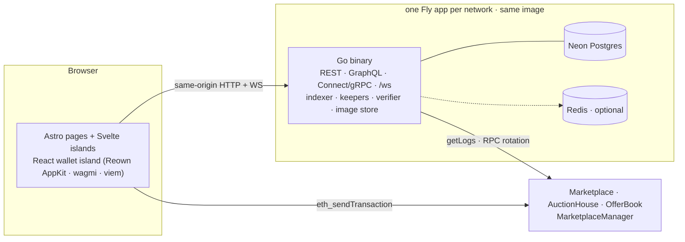

# MagicWebb

An open, non-custodial NFT marketplace on the [Flare](https://flare.network)
family of networks. No accounts, no login, no admin console: anyone with a
wallet can list, bid, offer and buy. Fixed-price listings, English auctions and
fully escrowed offers for ERC-721 and ERC-1155.

- **Fee: 2 %, seller pays, only on a sale** — 1.5 % to the platform, 0.5 % to
  the keeper that automates settlement. Listing, auctioning, bidding and
  offering are free (gas only) and every escrow is refundable.
- **Nothing is pausable.** No entry or exit path — list, bid, offer, buy,
  cancel, settle, withdraw — can be halted by anyone.
- **One admin key per network** (instant UUPS upgrades + keeper rotation),
  rotatable in two steps and burnable forever with `renounceAdmin()`. The whole
  control trail is public at `/status` and `/api/v1/governance`.
- **Badges are computed, never granted**: ✓ on an NFT whose collection passed
  the verifier and whose name, image and holder are known; ★ when the holder is
  the collection's creator and minted the token.
- **15 durations** (1 m … 24 h) shared by listings, auctions and offers;
  expiry is computed on-chain from the mining block.

| Network | Chain | App | Status |
|---|---|---|---|
| Coston2 (testnet) | 114 | https://magicwebb.fly.dev | **trading** — contracts live since block 34905078 (2026-09-04) |
| Songbird | 19 | https://magicwebb-songbird.fly.dev | browse-only until the contracts deploy (wave 9, owner-gated) |
| Flare | 14 | https://magicwebb-flare.fly.dev | browse-only until the contracts deploy (wave 9, owner-gated) |

Addresses: [`deployments/`](deployments/) is the single source of truth.

## How it is built



The browser talks to the **contracts directly** (the wallet signs); the backend
**observes** the chain through its indexer and projects state into Postgres for
fast reads and live updates. One process serves exactly one chain; switching
network is a navigation to the sibling origin. NFT images are fetched once,
hashed and served from our own store — no IPFS gateway at render time.

Read the map in [`docs/ARCHITECTURE.md`](docs/ARCHITECTURE.md) and the
diagrams (deployment, request path, indexer + keeper loop, state machines,
roles, governance, badges, screenshots) in
[`docs/SYSTEM_BREAKDOWN.md`](docs/SYSTEM_BREAKDOWN.md).

## Tech stack

| Layer | Tech |
|---|---|
| Contracts | Solidity 0.8.26, Foundry, OpenZeppelin v5 — three UUPS cores + one plain `MarketplaceManager` |
| Backend | Go 1.26, [Fiber](https://gofiber.io) v2, pgx v5 + goose migrations, go-ethereum, gqlgen, connect-go, zerolog; optional Zig media helpers (`-tags zigmedia`) |
| Frontend | Astro 7 (static), Svelte 5 islands, one React island for the wallet (Reown AppKit, wagmi, viem), self-hosted Inter + JetBrains Mono, Mermaid for the docs |
| Data | [Neon Postgres](https://neon.tech) — one project per network; Redis optional (shared read caches only) |
| Real-time | `/ws` channels, GraphQL subscriptions, Connect server streams, webhooks — all fed by one broadcaster |
| Auth | Sign-In-with-Ethereum → JWT, only for saved searches, notifications, profile edits and webhooks |
| Hosting | [Fly.io](https://fly.io) — three apps in `sin`, one Docker image built once per push |
| CI | GitHub Actions: Go build/vet/race, Foundry, Slither, gitleaks, `astro check`, vitest, Playwright (light + dark + mobile, axe-gated), proto drift, governance check, CodeQL; nightly full suite; `audit.yml` on `v*` tags |

## Repository layout

```
app/                 Astro 7 UI · Svelte 5 islands · React wallet island
  src/lib/tx         contract write flows (viem) · runner state machine · builders · durations
  src/lib/ws         MwSocket · channels           src/lib/chains   per-network mirror of the Go profile
  src/lib/optimistic.ts  optimistic reducers        src/pages/docs   user docs (served at /docs)
  e2e/               Playwright smoke suite + docs screenshot spec
backend/             Go 1.26 · Fiber
  cmd/server         boot: migrate → connect → guard → indexer → http
  cmd/keeperrotate · cmd/reindexgov · cmd/chainwipe   operator tools
  internal/chain/profile   per-network tuning table (validated at boot)
  internal/indexer   watcher · instant lane · keepers · metadata · governance · ops health
  internal/ws · sse · graphql · connectrpc · api · cache · rpcpool · verifier · imagestore · ops
contracts/           Foundry · src/ · test/ · script/DeployV34.s.sol · script/DeploySafe.s.sol
deployments/         per-network address records (source of truth, schema-checked)
docs/                operator docs + system breakdown + screenshots
tools/               upgrade-cores.sh · check-governance.sh · check-deployments.sh
fly.<net>.toml.example   per-network Fly templates (CI fills placeholders)
.github/workflows    ci · deploy · nightly · audit · codeql
```

## Run it locally

Prerequisites: Go 1.26+, Node 20+, [Foundry](https://book.getfoundry.sh/) for
the contracts, a Neon (or any) Postgres URL. `RPC_URL` is optional — the
network profile's public RPC set rotates by default.

```bash
# backend (serves the API, /ws, and the built UI from app/dist when present)
cd backend
export CHAIN_ID=114 POSTGRES_URL=postgres://… JWT_SECRET=$(openssl rand -hex 32)
export MARKETPLACE_ADDR=0x… AUCTION_ADDR=0x… OFFERBOOK_ADDR=0x…   # from deployments/coston2.json
go run ./cmd/server            # :8080 · migrations run at boot · /healthz /readyz

# frontend with hot reload (proxies /api, /auth, /ws to :8080)
cd app && npm install && npm run dev      # http://localhost:4321
```

On Windows, `./dev.ps1` loads `.env` and starts the backend with hot reload.
`.env.example` lists every variable; the required ones are `CHAIN_ID`,
`POSTGRES_URL`, `JWT_SECRET` (≥ 32 chars) and the three contract addresses.
A network with no contracts (`status: read-only` in `deployments/`) boots in
browse-only mode.

## Tests

```bash
cd contracts && forge test                         # unit + fuzz + invariants
cd backend   && go test ./... -race                # whole backend (vet the WHOLE module before pushing)
cd app       && npm test && npm run check          # vitest + astro check
cd app       && npm run build && npm run test:e2e  # Playwright: desktop light, desktop dark, mobile; axe gate
cd app       && npm run shots                      # docs screenshots → docs/images/v3.6/
```

CI runs all of it on every push and PR; `nightly.yml` adds the race + Foundry +
Slither + gitleaks sweep, `audit.yml` runs on `v*` tags.

## Contracts

```bash
cd contracts
forge build && forge test
# deploy a network (unsealed, admin-held, instant upgrades) — see docs/DEPLOY_CHECKLIST.md
PRIVATE_KEY=0x… ADMIN_ADDR=0x… FEE_RECIPIENT_ADDR=0x… KEEPER_ADDR=0x… \
  forge script script/DeployV34.s.sol --rpc-url <rpc> --broadcast
# upgrade all three cores on a live network (deploy impls → queue + install → verify → record)
ADMIN_KEY=0x… DEPLOYER_KEY=0x… tools/upgrade-cores.sh coston2 [--dry-run|--verify|--rollback]
```

`MarketplaceCore` holds the shared rules: `PLATFORM_FEE_BPS = 200` split
150 / 50 between `feeRecipient` and the keeper, `MIN_PRICE = 1 ether`, the
fifteen durations, pull-payment refunds, and the admin-gated UUPS path.
Governance, rotation and sealing: [`docs/UPGRADE_RUNBOOK.md`](docs/UPGRADE_RUNBOOK.md),
[`docs/IMMUTABILITY_TRANSITION.md`](docs/IMMUTABILITY_TRANSITION.md).

## Deployment

Push to `main` = deploy. `deploy.yml` builds one image, pushes it as
`sha-<commit>`, and deploys it to the three Fly apps with each network's
environment derived from `deployments/*.json`. Verify with

```bash
curl -sI https://magicwebb.fly.dev/healthz | grep -i x-mw-build-sha
```

Bringing a network up, read-only or trading: [`docs/NETWORKS.md`](docs/NETWORKS.md),
[`docs/DEPLOY_FLY.md`](docs/DEPLOY_FLY.md), [`docs/DEPLOY_CHECKLIST.md`](docs/DEPLOY_CHECKLIST.md).
Monitoring and alerts: [`docs/MONITORING.md`](docs/MONITORING.md). Backups and
the restore drill: [`docs/RUNBOOK_RESTORE.md`](docs/RUNBOOK_RESTORE.md).

Running cost is the Fly machines (three × shared-cpu-1x) and Neon usage; the
free tier covers a testnet. No IPFS pinning, no third-party object storage, no
paid RPC.

## Documentation

User docs are served by the app at `/docs` (source `app/src/pages/docs/`):
Start here, Whitepaper, Technical whitepaper, **System breakdown**, User guide,
What you can do, FAQ, Token architecture, API reference (`/docs/api.yaml`).

Operator docs in [`docs/`](docs/): `ARCHITECTURE.md`, `SYSTEM_BREAKDOWN.md`,
`NETWORKS.md`, `DEPLOY_FLY.md`, `DEPLOY_CHECKLIST.md`, `UPGRADE_RUNBOOK.md`,
`IMMUTABILITY_TRANSITION.md`, `MONITORING.md`, `RUNBOOK_RESTORE.md`,
`DESIGN.md`, `USER_CAPABILITIES.md`. Release notes: [`CHANGELOG.md`](CHANGELOG.md).

Migration numbering note: `backend/internal/db/migrations` skips 031 on
purpose — never renumber goose files.

## License

See repository.
