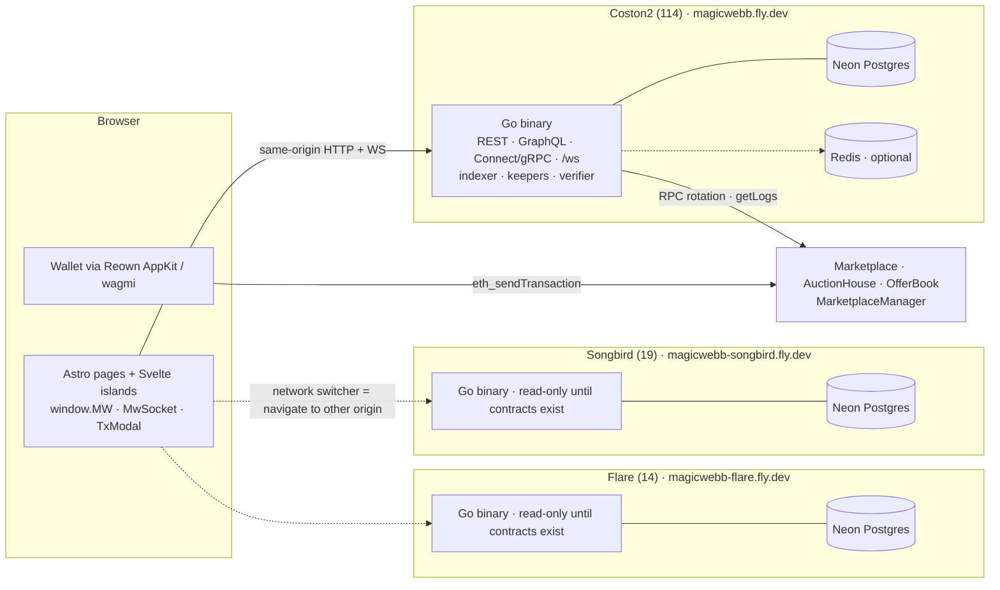
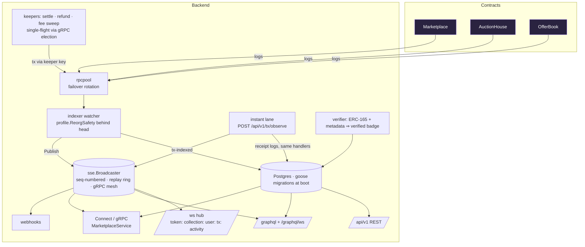
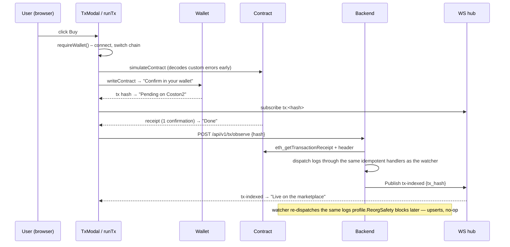

# MagicWebb — system architecture

Open, non-custodial NFT marketplace on the Flare family of networks. No user accounts, no
login, no admin console: anyone with a wallet on a supported network can list, bid, offer
and buy. (Protocol authority is a separate matter — v3.4: a single `admin`
address handles instant upgrades, keeper replacement and its own 2-step rotation until renounced, and a
single `keeper` address automates settlement; see
`IMMUTABILITY_TRANSITION.md`. No role can pause trading entries or exits.) This document is
the map; `USER_CAPABILITIES.md` is what each kind of user can do; `NETWORKS.md` is how a
network is provisioned.

## 1. One stack per network



One process serves exactly one chain (`CHAIN_ID` validated against
`backend/internal/chain/profile`). Switching network is a navigation to another origin —
the wallet, API, database and socket are all scoped to that origin (sessions do not cross
origins; the destination site prompts connect as usual). `NETWORK_URLS` (generated in CI
from `deployments/*.json`) tells each app which siblings exist.

A network's status in `deployments/<key>.json` follows `not-deployed → read-only →
deployed` (see `NETWORKS.md`). In read-only mode the binary serves the UI, API, wallet
and profile; the indexer, keepers and verifier idle until contracts exist, and the UI
shows a dismissible banner plus read-only empty states pointing at the Coston2 origin.

Per-network tuning (finality depth, poll cadence, keeper tickers, getLogs caps, gas caps,
default RPCs, identity) lives in one table: `backend/internal/chain/profile`. Shared code
(`internal/chain`, `rpcpool`, `indexer`, `keeper`, `ws`, `sse`) reads the active profile.
The browser mirror is `app/src/lib/chains.ts`; a Go test keeps the two and
`deployments/<key>.json` in agreement.

## 2. Request & event flow inside one network



## 3. A transaction, end to end (the instant lane)



Every page flips the affected region to an optimistic "… · syncing" state at "Done" and
clears it on `tx-indexed` (or on the next REST refresh). Nothing waits 30 seconds.

## 4. Contracts (Foundry, UUPS proxies)

| Contract | Purpose | Key rules |
|---|---|---|
| `MarketplaceCore` | base: fee math, pull-payment refunds, admin-gated upgrades (instant — `upgradeDelay` 0 on every network) | `PLATFORM_FEE_BPS = 200` (2%, **seller pays, only on sale**: 150 bps → `feeRecipient`, 50 bps → keeper, `FeeSplit` event) · `MIN_PRICE = 1 ether` · `_expiryFor(duration)` — fourteen durations 1m/3m/5m/15m/30m/45m/1h/2h/4h/8h/12h/16h/20h/24h, expiry computed on-chain · `withdrawRefund()` |
| `Marketplace` | fixed-price listings | `list / list1155 / batchList(≤50) / cancel / editPrice / buy` · `buy` requires `msg.value == price` · listing is free |
| `AuctionHouse` | English auctions, cumulative bids | `create / create1155 / bid / settle / cancelEarly / refundLosers / withdrawLoserFunds` · flat marketplace-wide increment: lead + 1 native (v3.3, no seller knobs) · anti-snipe +3 min, 30 min cap · settle: keeper (instant) or seller/winner only; forceCancel (+3d, keeper/seller/winner) is the never-stuck escrow backstop |
| `OfferBook` | escrowed offers | `makeOffer / makeOffer1155 / acceptOffer / cancelOffer / rejectOffer / refundExpiredOffer` · collection must be opted in via `setOfferEligible` (ERC-173 owner) |
| `MarketplaceManager` | single-keeper authority anchor + instant admin-gated upgrades (plain unproxied bytecode) | v3.4: `keeper` (one address — instant settlement, refund sweeps, expired-listing cleanup; cannot alter the keeper set) and `admin` (setKeeper; queueUpgrade+upgradeTo back-to-back, `upgradeDelay` 0; 2-step `transferAdmin`/`acceptAdmin` rotates the key; `renounceAdmin()` seals the deployment forever). Every network — Coston2, Songbird, Flare — deploys UNSEALED and admin-held; sealing is a later, explicit per-network `renounceAdmin()` on the owner's order. No role registry, no grant path. Nothing is pausable — no entry or exit path can ever be halted |

Deployed addresses: `deployments/<network>.json` (single source of truth).

## 5. Data

Neon Postgres, one project per network, 34 goose migrations applied at boot
(`backend/internal/db/migrations`; 031 intentionally skipped — never renumber). Row-level
security policies exist for direct PostgREST-style access; the Go service connects as an
owner role. `chain_id` is a label column on every indexed table. Idempotency: every indexed
write is an upsert keyed on `(tx_hash, log_index, …)`, which is what lets the instant lane
and the watcher process the same log twice safely.

Redis (optional, per network): shares the read caches across machines — trending (30s),
activity (10s), merged wallet inventory (30s); see `internal/cache`. Rate-limit counters
and SIWE nonces are Postgres-backed (`internal/ratelimit`, `internal/nonce`) so they hold
across instances without Redis. Unset means per-instance memory caches; an unreachable
Redis degrades to memory with a warning.

## 6. Real-time (P3 target: one spine, three faces)

`sse.Broadcaster` is the only publisher path. Today the WS hub and webhooks are fed from
it; GraphQL subscriptions and the Connect `StreamEvents` mesh exist as separate plumbing.
P3 unifies them: `/ws` for the product UI (channels + `?since` replay), GraphQL
subscriptions for third-party dashboards (hydrated objects), Connect `WatchEvents` server
streams for bots and keepers, and a generated event catalog that keeps all three in sync.

## 7. Repository layout

```
app/                 Astro 7 UI (static) · Svelte 5 islands · React wallet island
  src/lib/tx         contract write flows (viem) · runner state machine · builders (tested)
  src/lib/ws         MwSocket · channels
  src/lib/auth       SIWE
  src/lib/abi        generated from contracts/out (npm run gen:abi)
  src/components     TxModal · TokenPage · AuctionPage · OffersPage · RefundsPanel · …
backend/             Go 1.26 · Fiber
  cmd/server         boot sequence (migrate → connect → guard → indexer → http)
  internal/chain/profile   per-network tuning table
  internal/indexer   watcher · observe (instant lane) · keepers · metadata
  internal/ws · sse · graphql · connectrpc · api · cache · rpcpool · verifier
  zigsha256 · zigcrypto · zigsniff   Zig libraries (CGO, -tags zigmedia)
contracts/           Foundry · src/ · test/ (118) · script/Deploy*.s.sol
deployments/         per-network address records (source of truth)
docs/                operator docs (deploy, checklist, monitoring, immutability, networks)
fly.<net>.toml.example   per-network Fly templates · CI fills placeholders
.github/workflows    ci (zig/go/forge/slither/astro/vitest/gitleaks) · deploy (matrix) · nightly · audit · codeql
```

## Listing expiry (cleanExpired)

`Marketplace.cleanExpired(coll, id, seller)` exists on-chain (keeper-gated) but is
deliberately **unwired**: listings are non-custodial, so an expired listing holds no
on-chain state that needs cleanup — `buy` simply reverts `Expired`. Off-chain, the
indexer's `runListingExpirySweeper` flips expired listings out of the UI. Decision
2026-08-28: keep the function as a dormant escape hatch, do not call it from the keeper.

## 8. Capability matrix (v3.5 — mirrored in app/src/pages/docs/capabilities.md)

| Action | Viewer | Buyer (wallet) | Seller/Owner |
|---|---|---|---|
| Browse, search, view token/collection/profile/activity | ✓ | ✓ | ✓ |
| Buy a listing | connect prompt | ✓ | hidden on own |
| List (721 / 1155 units), 14 durations, min 1 | — | — | ✓ owner |
| Batch list up to 50 | — | — | ✓ 721 only |
| Change price / cancel listing | — | — | ✓ seller |
| Start auction (721 / 1155) | — | — | ✓ owner |
| Bid (+1 token over lead, cumulative) | connect prompt | ✓ (not seller) | — |
| Withdraw when outbid | — | ✓ | — |
| Cancel auction | — | — | ✓ only with no bids |
| Settle after end | — | ✓ winner | ✓ seller (+ keeper auto, 1s) |
| Cancel & refund everyone (3d after end) | — | ✓ winner | ✓ seller (+ keeper auto) |
| Make offer (if collection allows) | connect prompt | ✓ | — |
| Raise / withdraw own offer (full refund) | — | ✓ | — |
| Accept / decline / return expired | — | — | ✓ owner |
| Enable offers for a collection | — | — | ✓ ERC-173 owner |
| Save search / notifications (SIWE) | disabled + hint | ✓ | ✓ |
| Edit own profile (SIWE) | — | ✓ | ✓ |
| Switch network (keeps path) | ✓ | ✓ | ✓ |
| Anything admin | none exists | none | none |

No admin page, no login form, no roles. The only privileged key is the
per-network on-chain admin wallet (upgrades + keeper rotation), rotatable via
transferAdmin/acceptAdmin and eventually burned per network with renounceAdmin().
